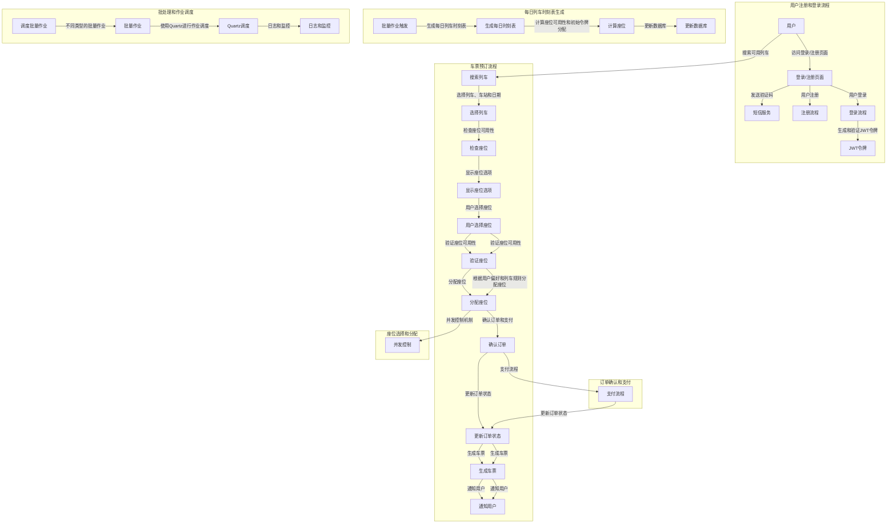
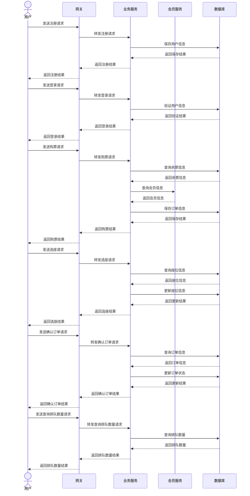

# 12306购票系统

## 项目简介

基于Spring Cloud Alibaba微服务架构的高铁票务系统，实现**单日千万级余票查询**与**秒级万级购票请求处理**。系统通过**多级缓存、异步削峰、分布式事务**等技术，解决动态库存、选座逻辑、超卖等业务难点，并针对12306典型高并发场景进行深度优化。

------

## 技术栈

| 层级         | 技术选型                                                     |
| ------------ | ------------------------------------------------------------ |
| **后端框架** | SpringBoot 3.0.0 + SpringCloud Alibaba 2022.0.0 + MyBatis 3.X |
| **前端框架** | Vue3 + Ant Design Vue                                        |
| **中间件**   | Redis（分布式缓存）、RocketMQ（异步削峰）、Nacos（注册/配置中心）、Seata（分布式事务）、Sentinel（限流熔断） |
| **数据库**   | MySQL 8.0（分库分表）+ 读写分离                              |

## 高并发场景优化

| 技术方案             | 实现效果                                          |
| -------------------- | ------------------------------------------------- |
| **双级验证码削峰**   | 前端验证码分散瞬时请求，后端验证码过滤机器人流量  |
| **令牌桶限流**       | 控制每秒处理量从10万→1万，响应时间<50ms           |
| **Redisson分布式锁** | 解决2000并发抢1000票场景下的超卖问题              |
| **RocketMQ异步排队** | QPS提升约25倍（从40 QPS→1000 QPS）                |
| **多级缓存架构**     | 余票查询响应<10ms（本地缓存+Redis+MySQL三级架构） |

## JMeter压测

### 测试环境

- 机器配置：i7-12700 , 16G
- 并发场景：500线程持续压测

### 性能对比

| 优化阶段             | QPS  | 平均响应时间 | 错误率 |
| -------------------- | ---- | ------------ | ------ |
| 基础版本（无中间件） | 42   | 2350ms       | 31%    |
| 加入Redis缓存        | 310  | 480ms        | 1.6%   |
| 增加MQ异步处理       | 1024 | 89ms         | 0%     |

### 关键指标提升

- **吞吐量提升24倍**：从42 QPS→1024QPS
- **响应时间降低98%**：从2350ms→89ms

## 流程图

## 时序图

